# Tutorial: Configuração de Issues, Milestones, Sprints e Kanban por Grupo

> Guia adaptado para uso em turma — cada **grupo** usa o próprio repositório e Project.

## Sumário

- [Tutorial: Configuração de Issues, Milestones, Sprints e Kanban por Grupo](#tutorial-configuração-de-issues-milestones-sprints-e-kanban-por-grupo)
  - [Sumário](#sumário)
  - [Pré-requisitos](#pré-requisitos)
  - [Passos para configuração](#passos-para-configuração)
  - [1. Criação do Repositorio no GitHUB](#1-criação-do-repositorio-no-github)
  - [2. Repositorio processo LAPIS](#2-repositorio-processo-lapis)
  - [3. Criação Project no GITHUB](#3-criação-project-no-github)
  - [4 Carregar Backlogs do Projeto](#4-carregar-backlogs-do-projeto)
    - [a) Geração do token de acesso](#a-geração-do-token-de-acesso)
  - [Como criar um Personal Access Token (PAT)](#como-criar-um-personal-access-token-pat)
  - [Fluxos de execução](#fluxos-de-execução)
    - [Fluxo A (com cópia para o repositório do grupo)](#fluxo-a-com-cópia-para-o-repositório-do-grupo)
    - [Fluxo B (sem alterar o repositório do grupo)](#fluxo-b-sem-alterar-o-repositório-do-grupo)
  - [Variáveis do grupo](#variáveis-do-grupo)
  - [Baixar scripts direto do GitHub (sem clonar)](#baixar-scripts-direto-do-github-sem-clonar)
  - [Setup completo em um único script](#setup-completo-em-um-único-script)
    - [Download rápido (ZIP)](#download-rápido-zip)
    - [Primeira execução (com criação automática de sprints)](#primeira-execução-com-criação-automática-de-sprints)
    - [Re-sincronização (quando o JSON mudar)](#re-sincronização-quando-o-json-mudar)
    - [Teste (dry-run)](#teste-dry-run)
  - [Scripts individuais (referência)](#scripts-individuais-referência)
  - [Windows: quando o PowerShell não é reconhecido](#windows-quando-o-powershell-não-é-reconhecido)
  - [Configuração do Kanban ajuste das raias (Manual)](#configuração-do-kanban-ajuste-das-raias-manual)
  - [Checklist rápido](#checklist-rápido)
  - [Troubleshooting](#troubleshooting)
  - [Segurança](#segurança)
  - [Bloco rápido (copiar e colar)](#bloco-rápido-copiar-e-colar)
  - [Uso em sala (professor)](#uso-em-sala-professor)
  - [Próxima aula: Gestão de Configuração (projeto de requisitos)](#próxima-aula-gestão-de-configuração-projeto-de-requisitos)
    - [Entregáveis](#entregáveis)
    - [Fluxo recomendado](#fluxo-recomendado)
    - [Critérios de qualidade](#critérios-de-qualidade)
    - [Comandos úteis](#comandos-úteis)

---

## Pré-requisitos

- PowerShell (Windows)
- Token GitHub com permissões: **`repo`** (se for privado) e **`project`**

Você pode seguir **um de dois fluxos**:

- Fluxo A: copiar scripts/JSON para o repositório do grupo.
- Fluxo B: executar localmente sem alterar o repositório do grupo (baixando do GitHub no momento da execução).

---

## Passos para configuração

1. Criar o repositorio no GitHUB e configurar acessos
2. Acessar o repositorio [https://github.com/ProfBezerra/LAPIS/](https://github.com/ProfBezerra/LAPIS/)
3. Criar um Project no GITHUB
4. Carregar os backlog para o projeto criado

## 1. Criação do Repositorio no GitHUB

* Criar um repositório no GitHub : [https://github.com/new](https://github.com/new)
* Nomear no padrão:
  * requisitos-2026-`<NOME DO SEU GRUPO>`

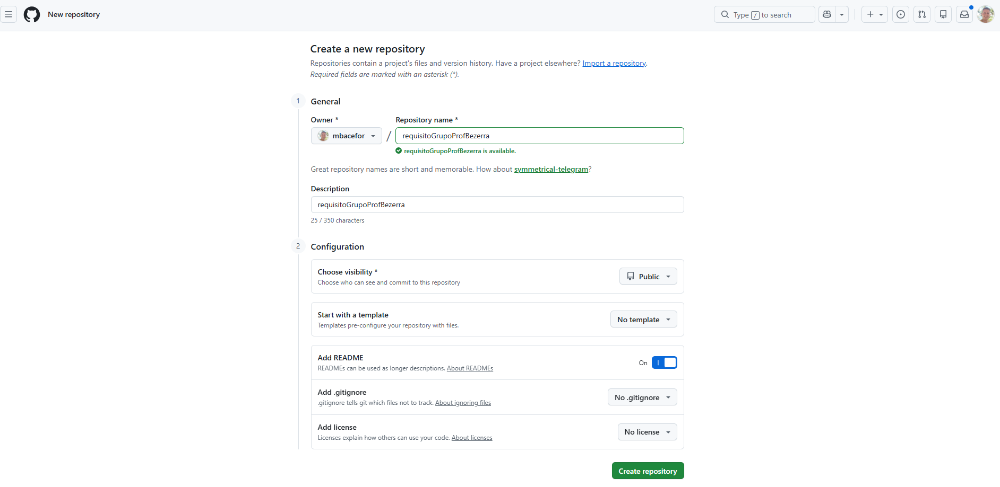

* Adicionar o professor como colaborador  (settings/access):
  * usuário: profBezerra

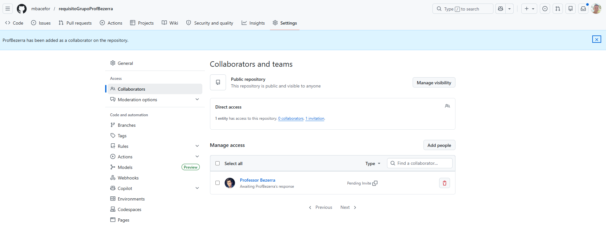

## 2. Repositorio processo LAPIS

Use o repositório como guia: [https://github.com/ProfBezerra/LAPIS/](https://github.com/ProfBezerra/LAPIS/)

Nele você vai encontrar os guias para as atividades a serem feitas e os templates dos documentos a serem preenchidos.

## 3. Criação Project no GITHUB

Na aba **Projects** clique no botão **+ New projec**t

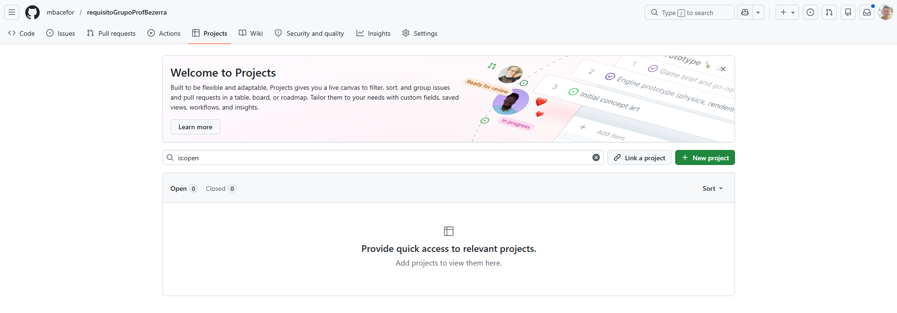

Selecione a opção **Board**

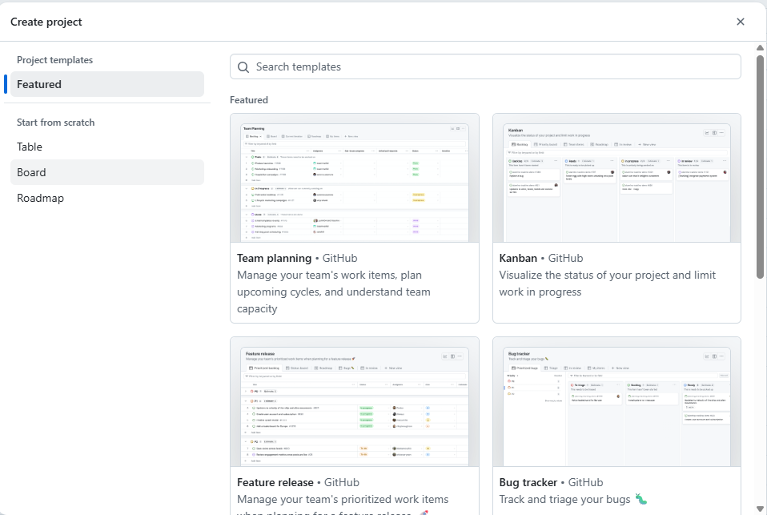

Depois clique no botão **Create project**

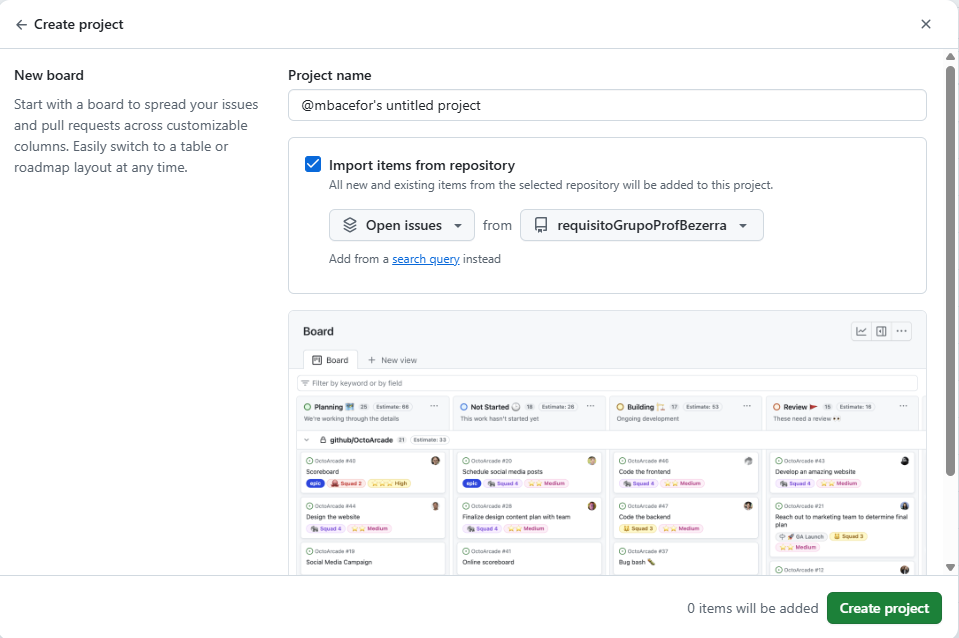

Será criado o plano conforme figura abaixo:

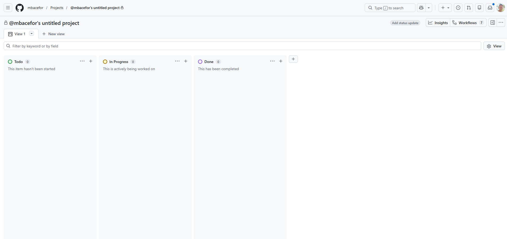

## 4 Carregar Backlogs do Projeto

Para não precisar digitar os backlog do projeto, foi criado um script para fazer a carga e configuração das sprints e marcos.

Seguem os passos

* a) Geração do token de acesso
* b) Execução do script para carga dos backlogs no GITHUB
* c) Ajustes visuais no Kanban do Project

### a) Geração do token de acesso

Para que o script possa ser executado é necessário que seja criado um token de acesso no GITHUB, onde se encontra o projeto.

#### Como criar um Personal Access Token (PAT)

Siga estes passos para gerar um token com as permissões necessárias:

1. No GitHub, clique no seu avatar → **Settings**.

   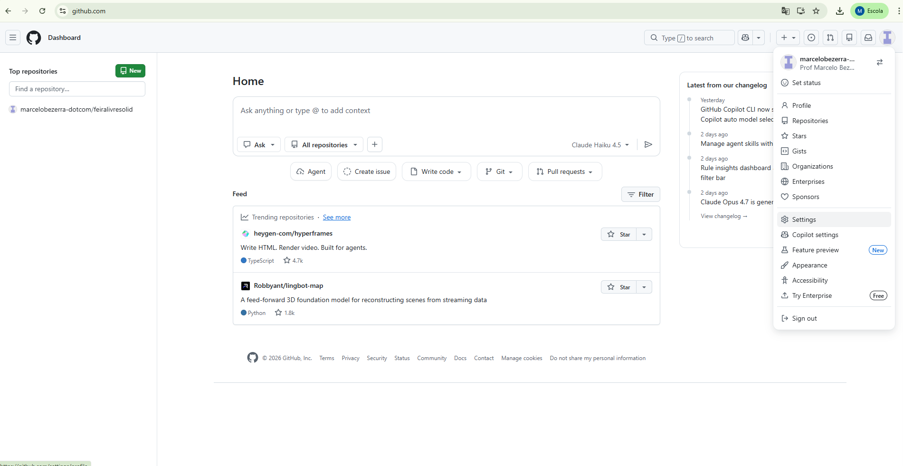
2. No menu lateral, abra **Developer settings** → **Personal access tokens** → **Tokens (classic)**.

   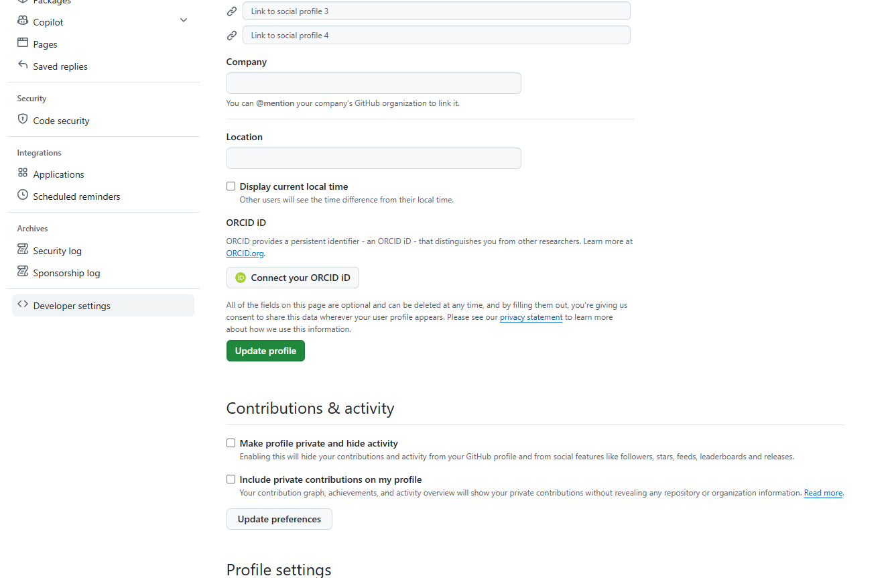
3. Clique em **Generate new token (classic)**.

   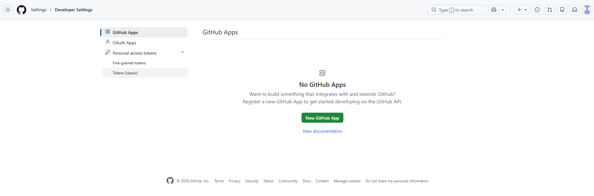

   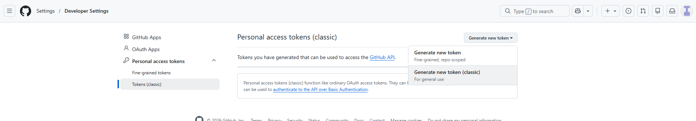
4. Informe um **nome/descritivo** e escolha uma **data de expiração** (recomendado).

   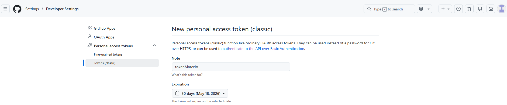
5. Em **Select scopes**, marque pelo menos:

   - `repo` — acesso ao repositório (necessário se o repositório for privado)
   - `project` — necessário para operações em GitHub Projects v2 (use token clássico se precisar de acesso a Projects)

   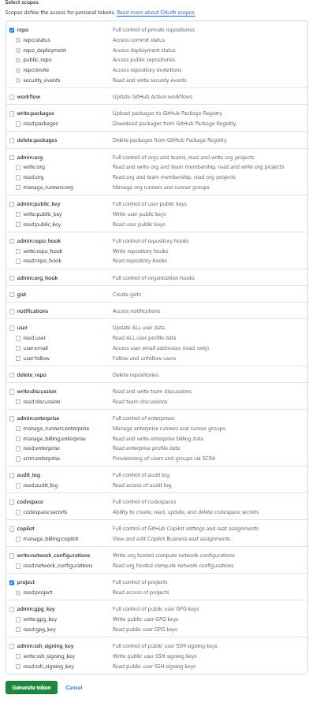
6. Clique em **Generate token** e **copie** o valor gerado — você não poderá vê-lo novamente.

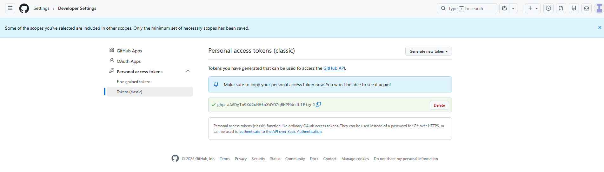

Boas práticas:

- Guarde o token em local seguro (ex.: gerenciador de senhas) e nunca o coloque em commits.
- Use variáveis de ambiente para execução local, ex. no PowerShell:

```powershell
$env:GITHUB_TOKEN = "SEU_TOKEN_AQUI"
```

- Revogue o token imediatamente se ele for exposto e gere um novo com permissões mínimas.

---

### b) Execução do script

Configurado o token agora é executar o script.

#### Setup completo em um único script

O script `setup-project.ps1` executa os dois passos automaticamente:

1. Importa labels, milestones e issues
2. Configura sprints e sincroniza o Project

##### Download rápido (ZIP)

Baixe o arquivo `lapis-setup.zip` diretamente do repositório — ele contém `setup-project.ps1` e `issues_github.json` prontos para uso:

- **Link:** [lapis-setup.zip](https://github.com/ProfBezerra/lapis/raw/main/lapis-setup.zip)

Após baixar, descompacte em qualquer pasta e execute.

Abra um bloco de nota (editor de texto) de cole os valores abaixo, para serem alterados por você.

```powershell
$env:GITHUB_TOKEN = "SEU_TOKEN_AQUI"

Set-Location "."
Set-ExecutionPolicy -Scope Process -ExecutionPolicy Bypass

& .\setup-project.ps1 `
  -Owner SEU_USUARIO_GITHUB `
  -Repo SEU_REPOSITORIO `
  -ProjectNumber NUMERO_PROJECT `
  -Token $env:GITHUB_TOKEN `
  -AutoCreateIterationField `
  -IterationFieldName "Sprint" `
  -IterationStartDate "2026-04-20" `
  -IterationDuration 14 `
  -IterationCount 5
```

> **Nota:** o ZIP não precisa estar dentro de um repositório Git — funciona em qualquer pasta local.

Substitua as variaveis conforme suas configurações:

* SEU_TOKEN_AQUI - substituir pelo token criado anteriormente
* SEU_USUARIO_GITHUB - substituir pelo nome do usuário do GITHUB
* SEU_REPOSITORIO - substituir pelo nome do repositorio criado
* NUMERO_PROJECT - substituir pelo numero do project criado. Para encontrar esse número, veja na URL que o seu plano foi criado. Depois do  **/projects/** vem esse número. Exemplo: https://github.com/users/mbacefor/projects/**8**/views/1 -  Nesse caso o número do projeto é 8.

Veja exemplo abaixo:

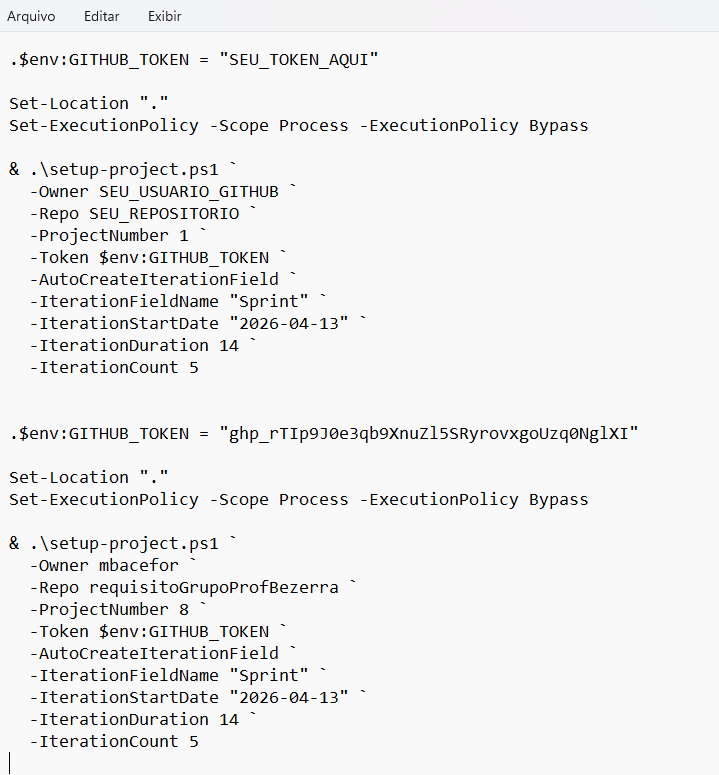

Agora abra o terminal do tipo PowerShell. *Menu Iniciar -> Windows PowerShell*

Depois use o comando CD para ir para a pasta onde você descompactou os arquivos.

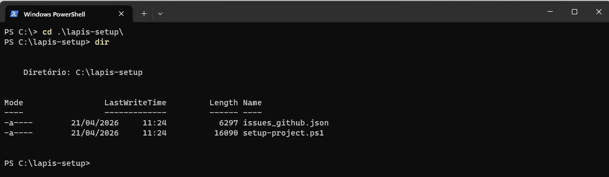

Por fiz execute os comando no terminal.

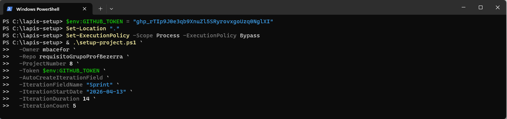

O resultado final será:

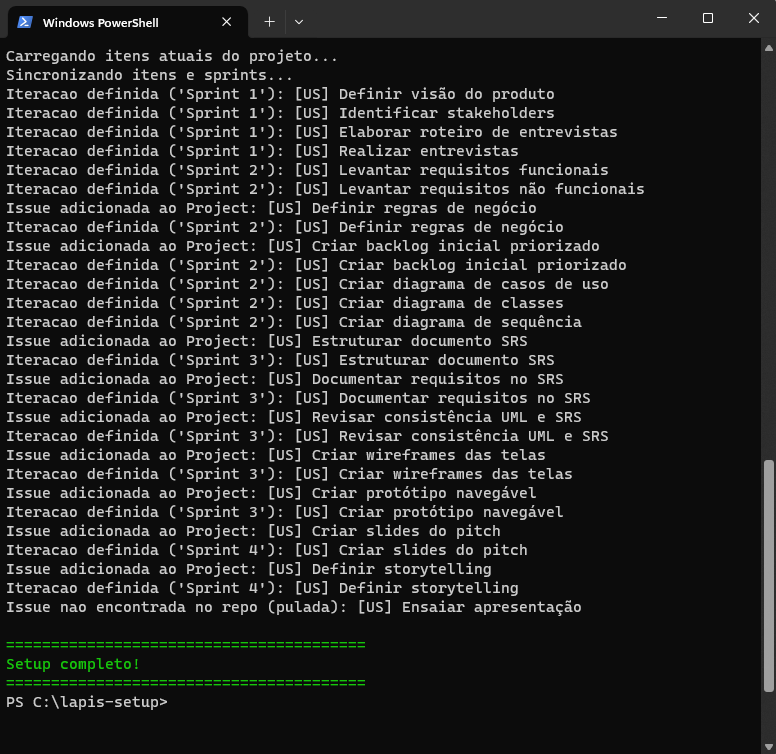

Agora abra o project no GITHUB e veja se os backlogs foram carregados.

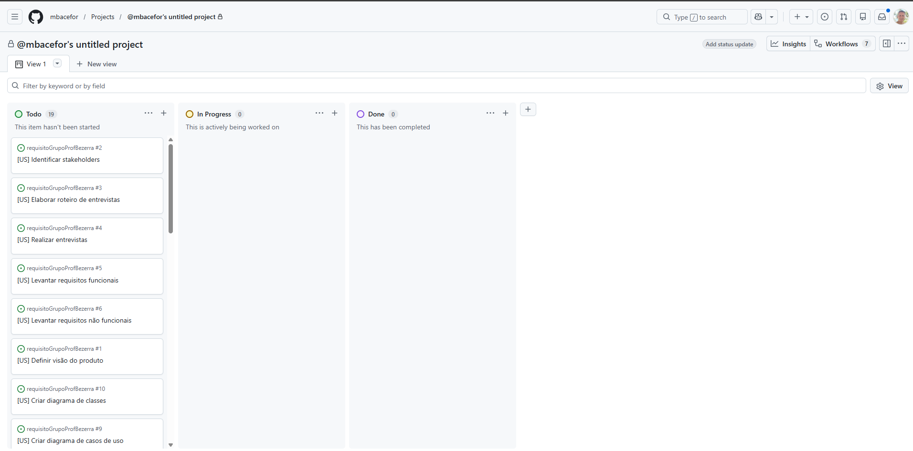

### c) Ajustes visuais no Kanban do Project

> A API do GitHub Projects v2 não expõe criação de views por script.

Passos no GitHub UI:

1. Abra o Project do grupo
2. Abra **Settings** do Project e ajuste a visibilidade para **Public** (Torna o Plano acessivel para todos)
3. Renomei a View para o Nome: `Kanban`
4. Em **Column by**, escolha **Status**
5. Em **Swimlanes**, escolha **Sprint**
6. Em **Slice by**, opção: **Milestone** (opcional)

Colunas recomendadas (campo `Status`):

- `Backlog`
- `Planejado`
- `Em Progresso`
- `Em Revisão`
- `Concluído`


---

## Windows: quando o PowerShell não é reconhecido

Se aparecer erro como "powershell nao e reconhecido como um comando interno ou externo", use uma destas opcoes:

1. Abra o terminal correto:

- Menu Iniciar -> Windows PowerShell
- ou Windows Terminal com perfil PowerShell

2. Execute pelo caminho completo (funciona mesmo sem PATH):

```cmd
%SystemRoot%\System32\WindowsPowerShell\v1.0\powershell.exe -NoProfile -ExecutionPolicy Bypass -Command "Get-Host"
```

3. Se voce tiver PowerShell 7 instalado, pode usar:

```cmd
pwsh -NoProfile -Command "Get-Host"
```

Se o script for bloqueado por politica de execucao, rode no PowerShell atual:

```powershell
Set-ExecutionPolicy -Scope Process -ExecutionPolicy Bypass
```

Isso vale apenas para a sessao atual.

Exemplo de execucao dos scripts a partir do CMD (sem depender do comando `powershell` no PATH):

```cmd
%SystemRoot%\System32\WindowsPowerShell\v1.0\powershell.exe -NoProfile -ExecutionPolicy Bypass -File .\scripts\import-github-issues.ps1 -Owner SEU_USUARIO_GITHUB -Repo SEU_REPOSITORIO -Token SEU_TOKEN_AQUI

%SystemRoot%\System32\WindowsPowerShell\v1.0\powershell.exe -NoProfile -ExecutionPolicy Bypass -File .\scripts\sync-project-sprints.ps1 -Owner SEU_USUARIO_GITHUB -Repo SEU_REPOSITORIO -ProjectNumber 1 -ProjectOwner SEU_USUARIO_GITHUB -Token SEU_TOKEN_AQUI
```

---

## Checklist rápido

- [ ] Token criado com `repo` e `project`
- [ ] Variáveis do grupo preenchidas
- [ ] Escolhido o método: ZIP
- [ ] Script `setup-project.ps1` executado
- [ ] Project configurado como público
- [ ] View Kanban criada e colunas ajustadas

---

## Troubleshooting

- **Erro:** `Resource not accessible by personal access token` — Token sem permissão `project`.
- **Mensagem:** `Sem iteracao correspondente para 'Sprint X'` — A sprint não existe no campo Iteration do Project.
- **Issues não aparecem no Project:** Verifique `ProjectNumber`, `ProjectOwner` e permissões do token.
- **Erro:** `'powershell' nao e reconhecido` — abra o Windows PowerShell/Windows Terminal (perfil PowerShell) ou use o executavel completo: `%SystemRoot%\System32\WindowsPowerShell\v1.0\powershell.exe`.
- **Erro:** `running scripts is disabled on this system` — execute `Set-ExecutionPolicy -Scope Process -ExecutionPolicy Bypass` e tente novamente na mesma janela.

---

## Segurança

- Não compartilhe tokens em chats, prints ou commits.
- Revogue tokens expostos imediatamente.
- Gere um novo token após concluir a configuração.

---

## Uso em sala (professor)

Sugestão de condução:

1. Compartilhe este repositório como base para a turma.
2. Cada grupo cria seu repositório e Project.
3. Escolha o fluxo do ZIO:
4. Executam o comando `setup-project.ps1` com os parâmetros do grupo.
5. Validam com o checklist acima.

Resultados esperados:

1. Repositório do grupo com issues, labels e milestones criadas.
2. Project do grupo com sprints configuradas e issues distribuídas.
3. View Kanban criada com status padronizados.

---

## Próxima aula: Gestão de Configuração (projeto de requisitos)

Objetivo: estruturar controle de versões e mudanças do artefato de requisitos.

### Entregáveis

1. Convenção de commits (ex.: Conventional Commits).
2. Política de baseline por marco (M1, M2, M3).
3. Processo de controle de mudanças documentado.
4. Template mínimo de Pull Request.

### Fluxo recomendado

1. Atualizar artefatos (issue, SRS, UML, critérios de aceite).
2. Revisar impacto técnico e de negócio.
3. Gerar baseline em `main` com tag (ex.: `v1.0-requisitos`).

### Critérios de qualidade

1. Toda mudança de requisito vinculada a uma issue.
2. Toda issue relevante vinculada a uma milestone.
3. Alterações críticas com análise de impacto registrada.
4. Marcos finalizados com tag de baseline.
