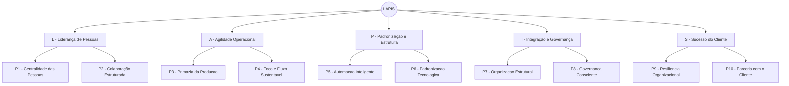
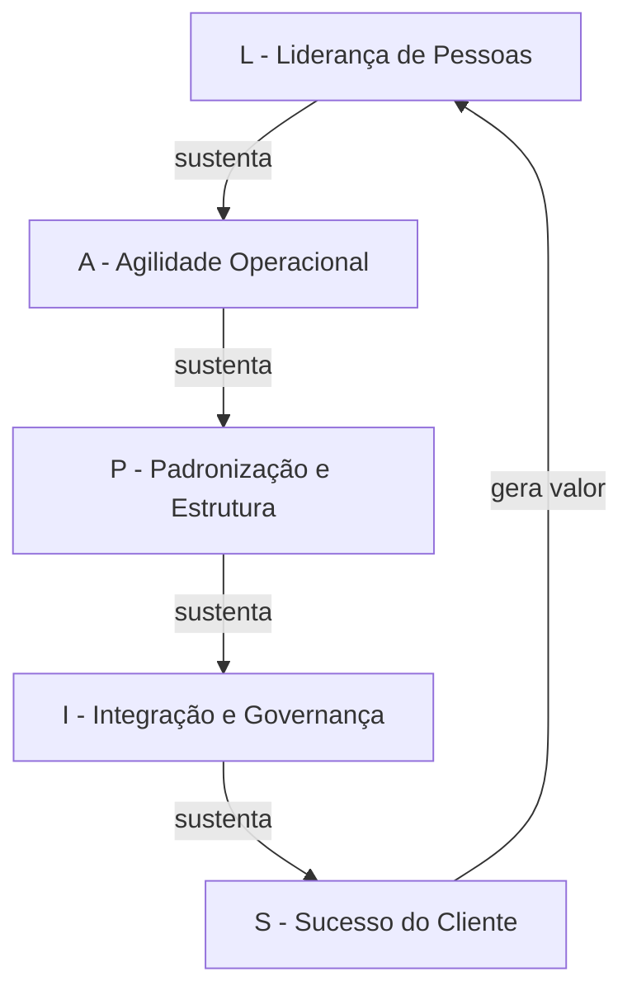

# 📘 Modelo LAPIS de Liderança Ágil

## Liderança, Agilidade, Padronização, Integração e Sucesso

*Um framework de liderança em engenharia de software orientado a princípios*

**Autor:** Marcelo Bezerra de Alcântara

---

# 1. Visão Geral

O **Modelo LAPIS** é um framework de liderança em engenharia de software que integra pessoas, operação, estrutura, governança e negócio em cinco dimensões complementares: **Liderança de Pessoas**, **Agilidade Operacional**, **Padronização e Estrutura**, **Integração e Governança** e **Sucesso do Cliente**.

Seu objetivo é garantir:

* Estabilidade operacional
* Eficiência na execução
* Sustentabilidade técnica
* Alinhamento organizacional
* Geração contínua de valor para o cliente

O modelo parte do princípio de que **agilidade não é definida por frameworks**, mas pela **qualidade das decisões guiadas por princípios claros e consistentes**.

---

# 2. Fundamentos do Modelo

O LAPIS é fundamentado em quatro convicções centrais:

1. **Pessoas fortes constroem equipes fortes**
2. **Equipes fortes constroem sistemas confiáveis**
3. **Sistemas confiáveis sustentam organizações sólidas**
4. **Soluções bem construídas geram valor real para o negócio**

---

# 3. Estrutura do Modelo LAPIS

O modelo é composto por cinco dimensões integradas. Cada dimensão está associada a dois princípios que orientam sua operacionalização.

---

## 🧭 L — Liderança de Pessoas

A base do modelo. Nenhuma prática técnica ou processo se sustenta sem pessoas desenvolvidas, engajadas e protegidas de dinâmicas disfuncionais.

### Diretrizes:

* Pessoas em primeiro lugar
* Trabalho em pares
* Rotação entre sistemas
* Eliminação da cultura de "heróis"

### Princípios associados:

* **P1 — Centralidade das Pessoas**
* **P2 — Colaboração Estruturada**

### Objetivo:

Construir equipes resilientes, colaborativas e sustentáveis.

---

## ⚙️ A — Agilidade Operacional

Execução com disciplina e foco. A agilidade real não é velocidade desordenada — é a capacidade de entregar com previsibilidade, reagir a problemas com rapidez e eliminar desperdícios sistêmicos.

### Diretrizes:

* Produção como prioridade máxima
* Tratamento imediato de incidentes
* Redução de multitarefa excessiva
* Automação de tarefas repetitivas

### Princípios associados:

* **P3 — Primazia da Produção**
* **P4 — Foco e Fluxo Sustentável**

### Objetivo:

Garantir estabilidade operacional e eficiência contínua.

---

## 🧱 P — Padronização e Estrutura

Redução da complexidade e aumento da previsibilidade. Ambientes técnicos fragmentados geram risco, dependência de indivíduos e crescimento de dívida técnica.

### Diretrizes:

* Homogeneização tecnológica
* Organização dos sistemas
* Migração estruturada para o estaleiro
* Atualização contínua

### Princípios associados:

* **P5 — Automação Inteligente**
* **P6 — Padronização Tecnológica**

### Objetivo:

Criar um ambiente técnico sustentável e escalável.

---

## 🏛 I — Integração e Governança

Alinhamento com a organização. Times que operam em isolamento geram inconsistências, retrabalho e risco institucional. Governança bem aplicada não é burocracia — é proteção.

### Diretrizes:

* Conhecimento das normas da empresa
* Conformidade técnica
* Alinhamento com diretrizes institucionais

### Princípios associados:

* **P7 — Organização Estrutural**
* **P8 — Governança Consciente**

### Objetivo:

Garantir segurança, previsibilidade e aderência organizacional.

---

## 🚀 S — Sucesso do Cliente

A camada estratégica do modelo. Tecnologia que não gera valor para o negócio é custo sem retorno. O líder técnico deve ser também um parceiro estratégico do cliente.

### Diretrizes:

* Proximidade com o cliente
* Entendimento do negócio
* Proposição ativa de melhorias
* Foco em geração de valor

### Princípios associados:

* **P9 — Resiliência Organizacional**
* **P10 — Parceria com o Cliente**

### Objetivo:

Garantir que a tecnologia impacte positivamente o negócio.

---

# 4. Os 10 Princípios do Modelo LAPIS

Os princípios são a camada operacional do modelo. Eles traduzem as convicções centrais em comportamentos e decisões cotidianas do líder.

---

### P1 — Centralidade das Pessoas

Pessoas satisfeitas constroem sistemas sustentáveis. Liderar tecnologia é, antes de tudo, liderar pessoas. Sistemas, ferramentas e processos são consequência da cultura que escolhemos construir.

Comprometimentos:

* Promover um ambiente saudável e colaborativo
* Valorizar o desenvolvimento contínuo de cada integrante do time
* Garantir respeito, segurança e dignidade profissional como condição não negociável

> *"Sem pessoas fortalecidas, não há excelência técnica."*

---

### P2 — Colaboração Estruturada

Conhecimento não deve ser concentrado. A dependência de indivíduos isolados é um risco organizacional — não uma virtude. A colaboração eficaz precisa ser cultivada por práticas deliberadas, não deixada ao acaso.

Comprometimentos:

* Trabalho em pares como prática estruturante
* Redução ativa da figura do "herói" — aquele que é o único a saber fazer algo
* Decisões técnicas compartilhadas e discutidas, não centralizadas

> *"Dependência individual é risco organizacional."*

---

### P3 — Primazia da Produção

Produção é prioridade absoluta. O ambiente de produção é a realidade do cliente — qualquer instabilidade nele supera qualquer outra demanda em curso. Esse princípio está alinhado às práticas modernas de confiabilidade de sistemas, como as difundidas pelo SRE da Google.

Comprometimentos:

* Manter sistemas funcionando corretamente em produção como missão permanente
* Tratar incidentes de produção com resposta imediata e dedicação total
* Exigir testes funcionais obrigatórios antes de qualquer implantação

> *"Estabilidade protege o negócio, a reputação e a confiança institucional."*

---

### P4 — Foco e Fluxo Sustentável

Multitarefas excessivas enfraquecem resultados. Equipes fragmentadas em muitas frentes simultâneas entregam menos, com pior qualidade e maior custo humano. O líder deve proteger ativamente a concentração do time.

Comprometimentos:

* Evitar paralelização desnecessária de execução de demandas
* Reduzir a fragmentação da equipe entre muitos sistemas e projetos ao mesmo tempo
* Manter pessoas produtivamente alocadas com planejamento estruturado

> *"Foco gera eficiência. Dispersão gera desperdício."*

---

### P5 — Automação Inteligente

O tempo humano deve gerar valor. Tarefas repetitivas, manuais e propensas a erro consomem capacidade operacional sem retorno estratégico. A automação não é um luxo — é uma responsabilidade do líder técnico.

Comprometimentos:

* Automatizar tarefas repetitivas sempre que tecnicamente viável
* Priorizar o uso das ferramentas já disponíveis no ambiente antes de buscar novas
* Reduzir o retrabalho manual que deveria ser sistemático

> *"Automação amplia capacidade operacional e libera energia para inovação."*

---

### P6 — Padronização Tecnológica

Complexidade desnecessária é custo oculto. A diversidade tecnológica não gerenciada eleva o custo de operação, dificulta a rotação entre times e aumenta a superfície de risco. Padronizar não é limitar — é criar a base estável sobre a qual evoluir com segurança.

Comprometimentos:

* Promover a homogeneização das tecnologias utilizadas pelo time
* Manter os sistemas atualizados como parte da rotina, não como evento extraordinário
* Reduzir ativamente a diversidade tecnológica que não tem justificativa estratégica

> *"Padronização reduz riscos, custos de manutenção e facilita evolução."*

---

### P7 — Organização Estrutural

Sistemas precisam estar organizados para evoluir. Ambientes desordenados geram retrabalho, aumentam o tempo de resposta a incidentes e criam dependência de pessoas específicas que "conhecem o mapa". Organização é um investimento, não uma tarefa administrativa.

Comprometimentos:

* Conduzir a migração estruturada dos sistemas para o estaleiro
* Manter os ambientes organizados, documentados e compreensíveis para todo o time
* Planejar continuamente a modernização como parte da agenda técnica

> *"Organização é a base para o crescimento sustentável."*

---

### P8 — Governança Consciente

Autonomia técnica exige responsabilidade institucional. Times que operam com ignorância das normas da organização não são mais ágeis — são mais frágeis. Conformidade bem compreendida não é burocracia; é proteção ao time e ao negócio.

Comprometimentos:

* Conhecer e manter-se atualizado sobre as normas e políticas da empresa
* Alinhar as decisões técnicas às diretrizes corporativas, antecipando conflitos
* Tratar conformidade como parte da excelência, não como obstáculo a ela

> *"Excelência técnica sem governança gera risco."*

---

### P9 — Resiliência Organizacional

Todo sistema deve ter múltiplos responsáveis capacitados. A resiliência organizacional não é resultado de esforço individual — é consequência de práticas sistemáticas que distribuem conhecimento e responsabilidade por todo o time.

Comprometimentos:

* Promover a rotação entre sistemas como prática regular, não como medida de emergência
* Ampliar continuamente o domínio técnico de cada integrante do time
* Reduzir silos de conhecimento antes que se tornem pontos críticos de falha

> *"Resiliência nasce da distribuição do saber."*

---

### P10 — Parceria com o Cliente

Tecnologia deve gerar valor real para o negócio do cliente. O líder técnico não é apenas executor de demandas — é parceiro estratégico. Entregar software não é suficiente; é necessário gerar impacto positivo e duradouro.

Comprometimentos:

* Construir relacionamento próximo com o cliente, baseado em confiança e compreensão do negócio
* Manter entendimento contínuo das necessidades e prioridades do cliente
* Propor ativamente melhorias e inovações antes de serem solicitadas
* Atuar como parceiro estratégico, não apenas executor técnico

> *"Entregar software não é suficiente — é necessário gerar impacto positivo no negócio do cliente."*

---

# 5. Mapa do Modelo

---

## Fluxo de Sustentação

---

# 6. Visão Sistêmica

O diferencial do LAPIS está na integração entre suas dimensões. Elas não são independentes — cada uma sustenta e pressupõe as demais:

* **Pessoas** sustentam a equipe
* **Operação** sustenta os sistemas
* **Estrutura** sustenta a evolução
* **Governança** sustenta a organização
* **Cliente** sustenta o valor

A ausência de qualquer uma dessas dimensões compromete o equilíbrio do modelo inteiro.

---

# 7. Diferenciais do Modelo LAPIS

O modelo se diferencia por:

* Ser orientado a **princípios**, não a frameworks ou cerimônias
* Integrar **operação e estratégia** em um único modelo coerente
* Equilibrar **estabilidade e evolução** sem opor uma à outra
* Reduzir **dependência de indivíduos** por design
* Conectar **tecnologia diretamente ao negócio**
* Ser **aplicável a diferentes contextos** sem exigir adaptação prévia de linguagem

---

# 8. Aplicação do Modelo

O LAPIS pode ser aplicado em:

* Times de desenvolvimento de software
* Equipes de sustentação e operação
* Áreas de tecnologia corporativa
* Ambientes com sistemas críticos
* Organizações em transformação digital

Não há pré-requisito de framework, porte de equipe ou maturidade tecnológica para adotar o modelo.

---

# 9. Benefícios Esperados e Como Medir

Os benefícios do modelo são observáveis e mensuráveis. Cada um deve ser acompanhado por indicadores definidos pelo time no início da adoção.

| Benefício Esperado                   | Exemplo de Indicador                         |
| ------------------------------------- | -------------------------------------------- |
| Redução de incidentes em produção | Número de incidentes críticos por mês     |
| Maior previsibilidade de entregas     | % de entregas dentro do prazo comprometido   |
| Redução de riscos operacionais      | Tempo médio de recuperação (MTTR)         |
| Aumento da produtividade do time      | Throughput de itens concluídos por sprint   |
| Melhoria da qualidade técnica        | Taxa de defeitos pós-entrega                |
| Maior alinhamento com o negócio      | Satisfação do cliente (NPS ou equivalente) |

> Os indicadores acima são sugestões de referência. Cada contexto deve calibrar suas próprias métricas de acordo com os objetivos estratégicos da área.

---

# 10. Posicionamento do Líder

O líder que adota o Modelo LAPIS atua como:

* **Desenvolvedor de pessoas** — investe no crescimento individual e na força coletiva do time
* **Guardião da estabilidade** — protege produção e responde a riscos com agilidade e responsabilidade
* **Organizador do fluxo de trabalho** — reduz desperdícios, limita multitarefa e cria condições para entregas consistentes
* **Agente de governança** — conhece e aplica as normas institucionais como parte do trabalho, não como exceção
* **Parceiro estratégico do cliente** — entende o negócio, antecipa demandas e propõe soluções com visão de valor

Esse posicionamento não é um conjunto de papéis alternativos — é a atuação simultânea e integrada em todas essas frentes.

---

# 11. Considerações Finais

O Modelo LAPIS não propõe uma receita, nem substitui o julgamento do líder. Ele oferece uma estrutura de referência para que decisões difíceis sejam tomadas com base em princípios estáveis, em vez de reações ao contexto imediato.

Times que trabalham bem não são apenas times que entregam. São times que evoluem, que aprendem com erros, que protegem a produção, que entendem o cliente e que sustentam seu ritmo sem depender de indivíduos insubstituíveis.

Esse é o objetivo do LAPIS: construir líderes capazes de construir esse tipo de time.

---

## Convicção Final

> Pessoas fortes constroem equipes fortes.
> Equipes fortes constroem sistemas confiáveis.
> Sistemas confiáveis sustentam organizações sólidas.
> Soluções bem construídas geram valor real para o negócio.

*Minha liderança é guiada por estes dez princípios.*

---

*Modelo LAPIS — versão 2.0*
*Autor: Marcelo Bezerra de Alcântara*
*Data: março de 2026*
