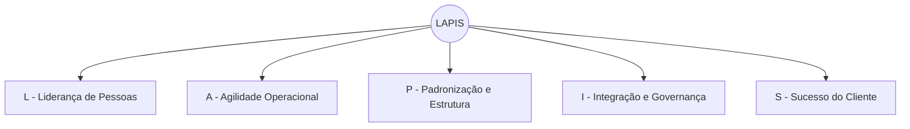

# 📘 Modelo LAPIS de Liderança Ágil

> *Liderança, Agilidade, Padronização, Integração e Sucesso*

Um framework de liderança em engenharia de software orientado a princípios, que integra pessoas, operação, estrutura, governança e negócio em cinco dimensões complementares.

**Autor:** Marcelo Bezerra de Alcântara

---

## O que é o Modelo LAPIS?

O LAPIS parte da convicção de que **agilidade não é definida por frameworks**, mas pela qualidade das decisões guiadas por princípios claros e consistentes.

O modelo é estruturado em **5 dimensões**, **10 princípios** e uma definição de **processo de requisitos em 4 etapas** (Análise de Viabilidade, Elicitação, Especificação e Validação), traduzindo essas convicções em comportamentos e decisões cotidianas do líder.

---

## As 5 Dimensões

| Dimensão                                   | Foco                         | Princípios |
| ------------------------------------------- | ---------------------------- | ----------- |
| 🧭**L — Liderança de Pessoas**      | Pessoas e colaboração      | P1 · P2    |
| ⚙️**A — Agilidade Operacional**    | Operação e fluxo           | P3 · P4    |
| 🧱**P — Padronização e Estrutura** | Técnica e estrutura         | P5 · P6    |
| 🏛**I — Integração e Governança** | Organização e conformidade | P7 · P8    |
| 🚀**S — Sucesso do Cliente**         | Resiliência e valor         | P9 · P10   |

---

## Os 10 Princípios

1. **Centralidade das Pessoas** — pessoas satisfeitas constroem sistemas sustentáveis
2. **Colaboração Estruturada** — conhecimento não deve ser concentrado
3. **Primazia da Produção** — produção é prioridade absoluta
4. **Foco e Fluxo Sustentável** — multitarefas excessivas enfraquecem resultados
5. **Automação Inteligente** — o tempo humano deve ser direcionado à geração de valor
6. **Padronização Tecnológica** — complexidade desnecessária é custo oculto
7. **Organização Estrutural** — sistemas precisam estar organizados para evoluir
8. **Governança Consciente** — autonomia técnica exige responsabilidade institucional
9. **Resiliência Organizacional** — todo sistema deve ter múltiplos responsáveis capacitados
10. **Parceria com o Cliente** — tecnologia deve gerar valor real para o negócio

---

## Convicção Final

> Pessoas fortes constroem equipes fortes.
> Equipes fortes constroem sistemas confiáveis.
> Sistemas confiáveis sustentam organizações sólidas.
> Soluções bem construídas geram valor real para o negócio.

---

## Documentação Completa

O modelo completo, com descrição de cada dimensão, princípios detalhados, mapa visual, benefícios esperados e posicionamento do líder, está disponível em:

📄 [Lapis-v2.md](Lapis-v2.md)

Para aplicação prática em turma (issues, milestones, sprints e kanban por aluno), consulte:

📄 [TUTORIAL_GITHUB_PROJECTS.md](TUTORIAL_GITHUB_PROJECTS.md)
