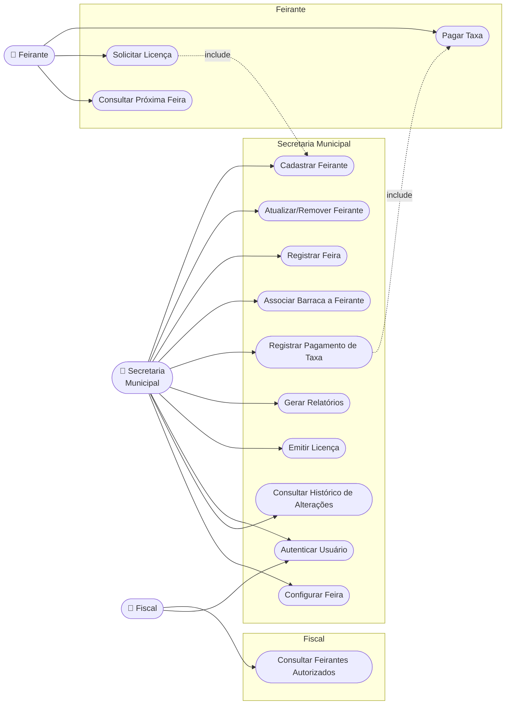
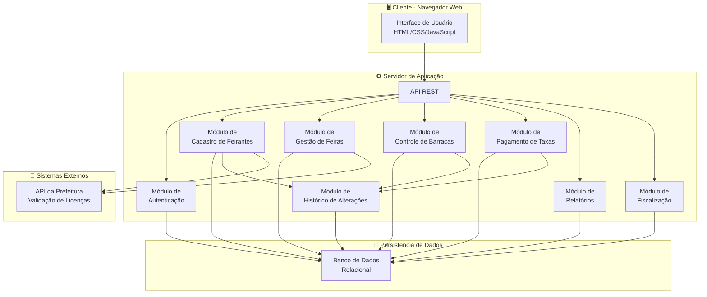
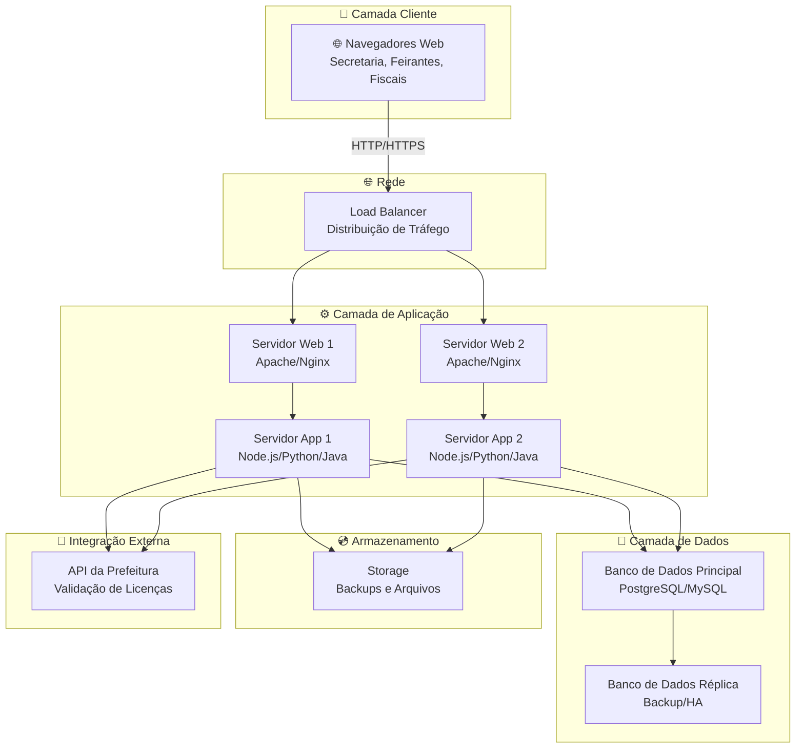
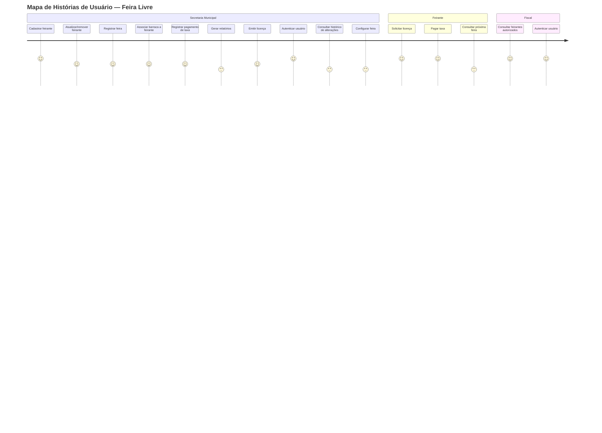

# Visão da Demanda (VD)

> **Exemplo preenchido — Sistema de Gestão das Feiras Livres de Fortaleza**

## Histórico de Versões

<table border="1" width="100%">
<colgroup>
    <col style="width: 12%" />
    <col style="width: 8%" />
    <col style="width: 66%" />
    <col style="width: 12%" />
</colgroup>
<thead>
    <tr>
        <th style="text-align: center;"><strong>Data</strong></th>
        <th style="text-align: center;"><strong>Versão</strong></th>
        <th style="text-align: center;"><strong>Descrição</strong></th>
        <th style="text-align: center;"><strong>Autor</strong></th>
    </tr>
</thead>
<tbody>
    <tr>
        <td>12/04/2026</td>
        <td>1.0</td>
        <td>Criação inicial do documento de visão para o Sistema de Gestão das Feiras Livres</td>
        <td>Equipe Lapis</td>
    </tr>
</tbody>
</table>

## 1. Objetivo

Definir a proposta de valor e o escopo do Sistema de Gestão das Feiras Livres de Fortaleza, detalhando as necessidades da Secretaria Municipal, dos [feirantes](../glossario-feira-livre.md#feirante) e dos fiscais.

## 2. Proposta de Valor

O sistema permitirá modernizar e digitalizar o controle das feiras livres municipais, facilitando o cadastro de feirantes, organização das barracas, controle de taxas e fiscalização. Espera-se maior transparência, agilidade administrativa e redução de erros e fraudes.

## 3. Descrição da Demanda

O sistema apoiará a Secretaria na organização das feiras, cadastro e controle de [feirantes](../glossario-feira-livre.md#feirante), registro de [barracas](../glossario-feira-livre.md#barraca), pagamento de taxas, geração de relatórios e consulta por fiscais. Todo o processo será digital, com autenticação de usuários e histórico de alterações.

## 4. Partes Interessadas

| Nome                        | Papel           | Responsabilidades                                 | Representante           |
|-----------------------------|-----------------|---------------------------------------------------|-------------------------|
| Secretaria Municipal        | Cliente         | Gerenciar feiras, aprovar cadastros, emitir licenças | Ana Lima                |
| Feirante                    | Usuário final   | Solicitar licença, pagar taxas, participar das feiras | -                       |
| Fiscal Municipal            | Stakeholder     | Consultar feirantes autorizados, fiscalizar barracas | José Silva              |
| Equipe de TI                | Desenvolvimento | Implementar e manter o sistema                      | Equipe Lapis            |

## 5. Personas

### 5.1. Feirante
- **Descrição:** Trabalhador autônomo que comercializa produtos nas feiras municipais.
- **Objetivo:** Conseguir licença, pagar taxas e participar das feiras de forma regularizada.

### 5.2. Fiscal Municipal
- **Descrição:** Servidor responsável por fiscalizar o funcionamento das feiras e a regularidade dos feirantes.
- **Objetivo:** Consultar rapidamente a lista de feirantes autorizados e registrar ocorrências.

## 6. Necessidades e Funcionalidades

### Necessidade 1: Cadastro e controle de feirantes

> **Nota:** Os termos [feirante](../glossario-feira-livre.md#feirante) e [barraca](../glossario-feira-livre.md#barraca) estão definidos no [glossário do projeto](../glossario-feira-livre.md).

#### F1.1 Cadastro de feirante
- **Descrição:** Permite cadastrar [feirantes](../glossario-feira-livre.md#feirante) com nome, CPF, produto e telefone.
- **Incluída**
- **Atores:** Secretaria Municipal
- **Frequência:** Alta
- **Valor:** Alto

#### F1.2 Atualização e remoção de cadastro
- **Descrição:** Permite atualizar ou remover dados de feirantes.
- **Incluída**
- **Atores:** Secretaria Municipal
- **Frequência:** Média
- **Valor:** Médio

### Necessidade 2: Organização das feiras e barracas

#### F2.1 Registro de feiras por bairro
- **Descrição:** Permite registrar feiras realizadas em cada bairro.
- **Incluída**
- **Atores:** Secretaria Municipal
- **Frequência:** Média
- **Valor:** Alto

#### F2.2 Controle de barracas por feirante
- **Descrição:** Permite associar uma [barraca](../glossario-feira-livre.md#barraca) a cada [feirante](../glossario-feira-livre.md#feirante) por feira.
- **Incluída**
- **Atores:** Secretaria Municipal
- **Frequência:** Alta
- **Valor:** Alto

### Necessidade 3: Pagamento e controle de taxas

#### F3.1 Registro de pagamento de taxas
- **Descrição:** Permite registrar pagamentos de taxas municipais pelos feirantes.
- **Incluída**
- **Atores:** Secretaria Municipal, Feirante
- **Frequência:** Alta
- **Valor:** Alto

#### F3.2 Geração de relatórios mensais de arrecadação
- **Descrição:** Gera relatórios mensais de taxas arrecadadas por feira.
- **Incluída**
- **Atores:** Secretaria Municipal
- **Frequência:** Mensal
- **Valor:** Alto

### Necessidade 4: Fiscalização e consulta

#### F4.1 Consulta de feirantes autorizados
- **Descrição:** Permite ao fiscal consultar lista de feirantes autorizados em uma feira.
- **Incluída**
- **Atores:** Fiscal Municipal
- **Frequência:** Alta
- **Valor:** Alto

### Necessidade 5: Segurança, desempenho e conformidade

#### F5.1 Autenticação de usuários
- **Descrição:** Garante que apenas usuários autorizados acessem funções administrativas.
- **Incluída**
- **Atores:** Secretaria Municipal, Fiscal
- **Frequência:** Sempre
- **Valor:** Alto

#### F5.2 Registro de histórico de alterações
- **Descrição:** Mantém histórico de alterações nos cadastros de feirantes.
- **Incluída**
- **Atores:** Secretaria Municipal
- **Frequência:** Sempre
- **Valor:** Médio

#### F5.3 Tempo de resposta das consultas
- **Descrição:** Todas as consultas devem responder em até 3 segundos.
- **Incluída**
- **Atores:** Todos
- **Frequência:** Sempre
- **Valor:** Alto

#### F5.4 Conformidade legal
- **Descrição:** O sistema deve seguir a legislação municipal vigente.
- **Incluída**
- **Atores:** Secretaria Municipal
- **Frequência:** Sempre
- **Valor:** Alto

## 7. Arquitetura da Demanda

O sistema será composto por módulos de Cadastro de Feirantes, Gestão de Feiras, Controle de Barracas, Pagamento de Taxas, Relatórios e Fiscalização. Utilizará banco de dados relacional e será acessível via navegadores web modernos. Integração com sistemas da prefeitura para validação de licenças e hospedagem em servidores próprios.

### 7.1. Diagramas UML

#### 7.1.1. Diagrama de Caso de Uso

Ilustra os atores (Secretaria Municipal, Feirante e Fiscal) e suas interações com os principais casos de uso do sistema.

#### 7.1.2. Diagrama de Componentes

Descreve os principais componentes do sistema e suas dependências.

**Componentes principais:**
- **Interface de Usuário** — Aplicação web responsiva acessível em navegadores modernos
- **Módulo de Autenticação** — Garante acesso seguro aos usuários
- **Módulos de Negócio** — Cadastro, Gestão, Barracas, Taxas, Relatórios, Fiscalização
- **Módulo de Histórico** — Registra todas as alterações nos cadastros
- **API REST** — Orquestra a comunicação entre cliente e servidor
- **Banco de Dados Relacional** — Armazena todos os dados do sistema
- **API da Prefeitura** — Integração para validação de licenças e dados cadastrais

#### 7.1.3. Diagrama de Implantação

Mostra como os componentes serão distribuídos nos ambientes de execução.

**Ambiente de execução:**
- **Camada Cliente** — Navegadores web dos usuários (Secretaria, Feirantes, Fiscais)
- **Load Balancer** — Distribui requisições entre servidores web
- **Servidores Web** — Hospedam a aplicação (com redundância)
- **Servidores de Aplicação** — Processam lógica de negócio (com redundância)
- **Banco de Dados Principal** — Armazena dados operacionais
- **Banco de Dados Réplica** — Backup e alta disponibilidade
- **Storage** — Armazena arquivos e backups do sistema
- **API da Prefeitura** — Integração externa via HTTPS

### Mapa de Histórias de Usuário

---

## Checklist de Validação do Documento de Visão

- [x] O objetivo está claro e alinhado ao problema/necessidade?
- [x] A proposta de valor é mensurável e relevante?
- [x] Todas as partes interessadas estão listadas com papéis definidos?
- [x] Existem pelo menos duas personas descritas?
- [x] Todas as necessidades e funcionalidades estão relacionadas a atores?
- [x] Há indicação de valor e frequência para cada funcionalidade?
- [x] A arquitetura está ilustrada com os diagramas UML (Caso de Uso, Componentes e Implantação)?
- [x] O documento está escrito em linguagem clara e objetiva?

---

> Consulte exemplos e dicas em: [Guia de Elaboração da Visão](../../../Elicitacao/VisaoDemanda.md)
