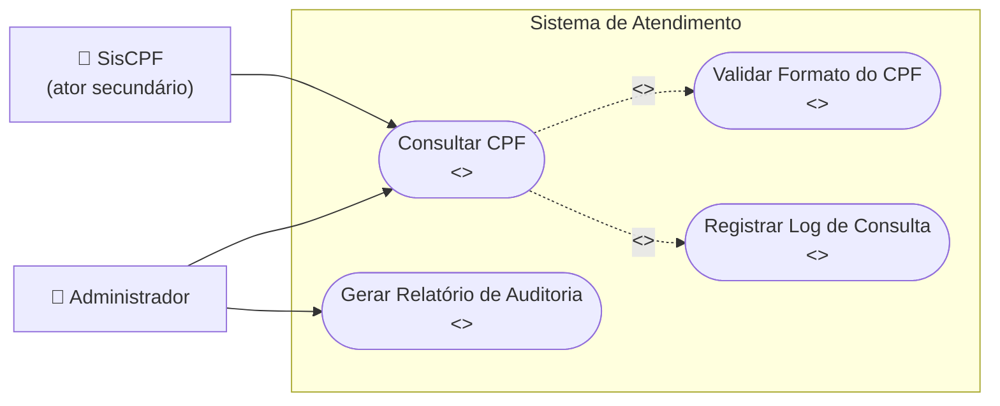

# Documentando Requisitos com Caso de Uso

Última atualização em 09/05/2026

## O que é?

* Descreve uma funcionalidade da solução, focando no comportamento da solução de forma a atender às necessidades dos stakeholders (técnica de caso de uso).

## Por que realizar?

* Define e compreende os requisitos funcionais da solução a partir da perspectiva dos usuários ou das soluções externas.
* Identifica o comportamento da solução de forma que ela atenda às necessidades dos stakeholders e usuários.
* Gera insumos para projetar e testar a solução.

## Quem realiza?

* Time da solução

## Envolvidos

* Cliente
* Especialistas no negócio
* Integrante do time da solução
* Stakeholder
* Outros times de soluções relacionadas

## Quando realizar

* Durante a construção para:

  * Construir nova solução
  * Evoluir solução
* No contexto que seja necessário:

  * Elaborar, analisar e melhor compreender o **comportamento** pretendido de uma solução complexa e composta por outras soluções ou
  * Descrever as interações com os usuários e soluções externas com mais  **detalhes técnicos** , inclusive com a descrição de pré e pós condições ou
  * Identificar todos os **cenários alternativos** que nos fazem tropeçar com tanta frequência quando se trata de qualidade ou
  * Manter a técnica de caso uso já utilizada na documentação de requisitos da solução

## Como realizar?

⚠️**Atenção:**

* Quando não for possível que o caso de uso corresponda a apenas uma funcionalidade, deve-se pelo menos garantir que cada funcionalidade estará detalhada no fluxo principal ou em um fluxo alternativo.
* Ao escrever casos de uso, utilize uma **linguagem simples**.

### 1. Nomeie o caso de uso

* Atribua um nome para o caso de uso que retrate claramente a ação que ele realiza, sabendo que o nome do caso de uso:
  * Inicia sempre com um verbo no infinitivo
  * Pode conter preposições e artigos
  * Tem suas palavras, exceto preposições, iniciadas com letra maiúscula, separadas por espaços e grifadas corretamente

**Exemplo📌:** “Cadastrar Usuário” e “Disponibilizar Dados da Frota de Veículos”

### 2. Determine o objetivo do caso de uso

* Descreva o propósito do caso de uso, observando que essa descrição deve:

  * Iniciar sempre com um verbo no infinitivo
  * Explicitar de forma clara e objetiva a finalidade do caso de uso
  * Considerar que um caso de uso deve estar associado apenas a um único  **objetivo principal** . Sendo que, no caso de objetivos secundários que se relacionam ou complementam o objetivo principal do caso de uso, analisar a possibilidade de utilizar pontos de extensão ou de inclusão.

  **Exemplo 📌:** Permitir a consulta de deduções, com a possibilidade de apresentação de todos os dados de uma dedução específica.

### 3. Classifique o caso de uso (opcional)

* Informe se o caso de uso é:
  * **Concreto** : isto é, quando ele é instanciado por pelo menos um ator e possui um fluxo completo de eventos.
  * **Abstrato** : isto é, quando ele nunca é instanciado diretamente por um ator. São incluídos («include») ou estendidos («extend») ou especializados (generalização) em outros casos de uso.

**Exemplo📌:**

Figura 1 - Diagrama de contexto com tipos diferentes de casos de uso

**Atenção⚠️:** Apesar do caso de uso **Consultar CPF** estar, visivelmente, ligado ao ator  **SisCPF** , esse é um ator secundário que representa uma solução externa que interage apenas trocando dados sem ação alguma de sua parte que dispare um evento no caso de uso  **Consultar CPF** .

### 4. Descreva os atores

* Detalhe os atores que interagem com o caso de uso, sabendo que é necessário:
  * Indicar o nome completo do ator conforme descrito no artefato visão da solução
  * Classificar o ator como:
    * **Primário** : o ator que mais interage direta ou indiretamente com o caso de uso. Esse ator **sempre inicia** o caso de uso.
    * **Secundário** : o ator que interage de forma passiva, somente cedendo ou recebendo informações. Não está restrito a soluções externas. Esse ator **não inicia** caso de uso.

**⚠️Atenção:** Em casos de uso abstratos, não é necessário enumerar o ator primário do caso de uso chamador.

**📌Exemplo:**

* Na Figura 1, o caso de uso  **Consultar CPF** , o ator Administrador é primário, enquanto o ator SisCPF, que apenas concede informações, é secundário.
* Quando um operador de telefone inicia o caso de uso em nome de um Cliente, o ator primário é o operador de telefone. Quando um caso de uso é acionado pelo tempo, ou seja, casos de uso batch, pode-se eleger a própria solução que aciona o caso de uso como ator primário, por exemplo o “Control-M”, ou quem opera essa solução, no caso, o Operador ou ainda o Relógio.

### 5. Descreva as pré-condições

* Registre as **condições** que devem ser **verdadeiras** antes que o caso de uso possa  **ser iniciado** , observando que:
  * Em casos de uso abstratos, é necessário indicar que houve a instanciação por outro caso de uso
  * Caso opte-se por informar o nome do caso de uso chamador e/ou o passo, é necessário manter os casos de uso abstratos atualizados quando de modificações nos passos e nome do caso de uso que o instancia.

**📌Exemplo:** O contribuinte deve possuir uma declaração de imposto para realizar uma retificação.

#### ⚠️ Atenção

* Não considere como pré-condição regras de uso da solução, tal como o  **usuário deve estar logado e estar habilitado na solução** . Exceto nos casos em que seja requerido um login específico para o uso da funcionalidade especificada no caso de uso.
* Quando houver o  **reuso do caso de uso abstrato** , indique nas pré-condições, que houve a instanciação do caso de uso abstrato por outro, sem informar o nome do caso de uso chamador.

**📌Exemplo:** O caso de uso deve ter sido instanciado por outro.

* Quando não houver o  **reuso do caso de uso abstrato** , indique nas precondições a ação do caso de uso chamador que instancia o caso de uso abstrato.

**📌Exemplo:** O ator deve ter selecionado a opção Consultar CPF do caso de uso Manter Usuário.

### 6. Descreva o fluxo principal

* Escolha o cenário que mais diretamente cumpre o **objetivo do caso de uso** para um dado ator, inclusive para casos que especifiquem CRUD (criação, leitura, atualização e exclusão de dados).
* Descreva os **passos** do  **fluxo principal** , seguindo as orientações para:

#### Como iniciar o fluxo principal

**No caso de uso concreto:**

* Inicie com uma ação do ator.
* Quando existirem níveis de acesso para a funcionalidade do caso de uso, indique esses níveis de forma:
  * Encadeada e sequencial; ou
  * Direta.

**Exemplo (ator iniciando o caso de uso):**

* **P1.** O ator seleciona a opção Monitoramento.
* **OU**
* **P1. Iniciar caso de uso**
  O ator seleciona a opção Monitoramento.
* **OU**
* O caso de uso é iniciado quando o ator seleciona a opção Monitoramento.

**Níveis de acesso encadeados e sequenciados:**

* **P1.** O ator seleciona a opção Monitoramento / Consultar / Dados Básicos.
* **OU**
* **P1.** O caso de uso é iniciado quando o ator seleciona a opção Monitoramento / Consultar / Dados Básicos.

**Níveis de acesso de forma direta:**

* **P1.** O ator seleciona a opção para consultar os dados básicos do monitoramento.
* **OU**
* **P1.** O caso de uso é iniciado quando o ator seleciona a opção para consultar os dados básicos do monitoramento.

**No caso de uso abstrato:**

* Inicie com uma ação da solução.

**Exemplo (solução iniciando o caso de uso):**

* **A3.** Selecionar a opção Excluir.
* **A3.1** No passo P6.
* ...
* **A3.6** A solução inclui o caso de uso "Gerar Log".
* **A3.7** O caso de uso é encerrado.

#### Como terminar o fluxo principal

Nos casos de uso concreto e abstrato, o fim do fluxo principal é opcional e pode ser descrito de forma explícita.

**Exemplos:**

* Caso de uso concreto:
  * **P10.** O caso de uso é encerrado.
  * **OU**
  * **P10.** Encerrar caso de uso.
* Caso de uso abstrato:
  * **P10.** A solução retorna ao caso de uso chamador.
  * **OU**
  * **P10.** Encerrar caso de uso.

#### Como referenciar atores

Referencie os atores (primário e secundário), observando:

* Utilize o nome do ator em vez do termo genérico "ator".
* Escreva o nome do ator com inicial maiúscula.
* Sempre que necessário, utilize herança entre atores.
* Se houver vários atores primários com o mesmo comportamento, é possível usar um termo genérico para o ator primário.
* Mesmo usando termo genérico para primários, atores secundários devem ser citados nominalmente.

**Exemplos:**

* Referência direta a atores primários e secundários:
  * **P1.** O Aluno seleciona a opção Cadastrar Matrícula.
  * **P2.** A solução apresenta formulário conforme regra de negócio e opções de ação.
  * **P3.** O Aluno preenche o formulário e seleciona Salvar. **[A1]**
* Uso de termo genérico para vários atores primários:
  * **P1.** O "Sistema chamador" acessa o sistema alvo.
  * **P2.** O sistema exibe formulário.
  * **P3.** O ator preenche o formulário para autenticação e seleciona Enviar.
  * **P4.** O sistema valida as informações.
  * **P4.2** O sistema envia dados para o **SisCPF**.
  * **P4.3** O sistema recebe do **SisCPF** a informação de disponibilidade.

#### Ação do ator e do sistema

* Registre a ação do ator ou do sistema usando verbo no presente do indicativo (3ª pessoa do singular).

**Exemplo:**

* **P4.** O sistema apresenta um formulário com o campo CPF habilitado e a opção Consultar.
* **P5.** O usuário preenche o formulário e seleciona a opção Consultar.

#### Representar a interação ator X sistema X ator

* Alterne entre passos do ator e do sistema.
* Para ações consecutivas do mesmo ator/sistema, avalie reunir em subpassos.

**Exemplo:**

* Quando não compensa criar subpassos:
  * **P3.** O usuário preenche o formulário e seleciona Salvar.
* Quando compensa criar subpassos:
  * **P4.** O sistema armazena os dados.
  * **P4.1** Valida os dados do formulário.
  * **P4.2** Armazena os dados.
  * **P4.3** Exibe a mensagem.

#### Referenciar regras de negócio

* Referencie regras de negócio apenas em passos de ação do sistema.
* Preferencialmente use uma regra por linha para facilitar rastreabilidade.

**Exemplo:**

* **P4.** O sistema apresenta formulário de consulta.
* **P4.1** Valida os dados conforme regra de negócio "RN - Validação do Formulário de Consulta". **[E1]**
* **P4.2** Exibe a mensagem IN01 com opções de continuidade.

#### Referenciar fluxos alternativos e de exceção

* Referencie o fluxo no passo do sistema em que a ação ocorre.
* Destaque a referência entre colchetes e em negrito.

**Exemplo:**

* **P4.1** Valida os dados do formulário conforme regra de negócio. **[E1]**
* **P4.2** Exibe mensagem com opções de ação.
* **P5.** O ator seleciona a opção OK. **[A3]**

#### Referenciar mensagens do sistema

* Referencie mensagens do sistema destacando o identificador em negrito.

**Exemplo:**

* **P4.2** Exibe a mensagem **IN01** e as opções OK e Cancelar.

#### Intitular passo

Use um dos formatos:

* Ator + verbo no indicativo + complemento.
* Verbo no infinitivo + complemento (nesse formato, deve-se indicar o ator responsável na descrição/subpassos).

**Exemplo:**

* **P4. O sistema lista as turmas**
* **P2. Apresentar formulário de consulta**
* **P3. Preencher formulário**
* **P4. Validar dados do formulário**

#### Indicar ponto de extensão

* Indique o caso de uso que estende o fluxo no passo em que a ação ocorre.
* Destaque o ponto de extensão entre colchetes e em negrito.

**Exemplo:**

* **P8.** O ator seleciona a opção "Estágio". **[PE1]**

#### Indicar ponto de inclusão

* Indique o caso de uso incluído no fluxo principal ou alternativo, no passo da ação do sistema.

**Exemplo (fluxo principal):**

* **P4.2** Inclui o caso de uso "Consultar dados da Receita".

**Exemplo (fluxo alternativo):**

* **A1.2.1** Inclui o caso de uso "Consultar CEP".

### 7. Descreva os fluxos alternativos

* Descreva os **passos** do **fluxo alternativo**, seguindo as orientações
  * Gerais para escrita do fluxo principal
  * Específicas para escrita de fluxo alternativo para:

#### Indicar ponto de entrada do fluxo alternativo

* No fluxo alternativo, informe o ponto de entrada no formato: **No passo Px...**
* Todo fluxo alternativo deve possuir ao menos um ponto de entrada identificado.

**Exemplo:**

* **A5.** Selecionar a opção Reincluir.
* **A5.1** No passo **P6**...

#### Indicar ponto de saída do fluxo alternativo

* Se a saída for para passo do fluxo principal anterior ao ponto de entrada, indique: **retorna ao passo Px**.
* Se a saída for para passo do fluxo principal posterior ao ponto de entrada, indique: **segue para o passo Px**.
* Se não houver saída para fluxo principal ou alternativo, o caso de uso deve ser encerrado.

**Exemplos:**

* Saída para passo anterior no fluxo principal:
  * **A3.1** No passo P6, o ator seleciona Cancelar.
  * **A3.2** O sistema retorna ao passo **P4.2**.
* Saída para passo posterior no fluxo principal:
  * **A3.1** Nos passos P6 ou P9, o ator seleciona Cancelar.
  * **A3.2** O sistema segue para o passo **P10**.
* Sem saída para fluxo principal:
  * **A3.6** O sistema inclui o caso de uso "Gerar Log".
  * **A3.7** O caso de uso é encerrado.

### 8. Descreva os fluxos de exceção

* Descreva os passos do **fluxo de exceção** , seguindo as orientações
* Gerais para escrita do fluxo principal e
* Específicas para escrita de fluxo de exceção

#### Orientações de escrita de fluxo de exceção

Para cada fluxo de exceção:

* Informe apenas a exibição de mensagem, exceto quando a mensagem já estiver referenciada em regra de negócio.
* Associe, como ponto de entrada, um ou mais passos do sistema.
* Atribua numeração sequencial crescente.

**Exemplo:**

* **E1.** Dados não encontrados para o critério de pesquisa.
  * **E1.1** No passo **P4.1**, o sistema:
  * **E1.1.1** Não encontra registro para o critério informado.
  * **E1.1.2** Apresenta a mensagem **ER0021**.
* **E2.** Campos com preenchimento incorreto.
  * **E2.1** Nos passos **P4.2** ou **A9.1.3**, o sistema:
  * **E2.1.1** Identifica erro de preenchimento.
  * **E2.1.2** Apresenta mensagem de erro conforme regra de negócio.

### 9. Descreva as pós-condições

* Relate como pós-condição:
  * Circunstâncias que podem ser garantidas como **verdadeiras** ao final do caso de uso.
  * Ações/eventos que **não** fazem parte do objetivo principal do caso de uso.

**📌Exemplo:** Após armazenar os dados do cliente é gerado o arquivo Dados.txt

### 10. Descreva os requisitos não funcionais

* Enumere os requisitos não funcionais que podem influenciar diretamente na construção da solução e são **aplicáveis somente** ao caso de uso em questão.

**⚠️Atenção:** **Não** inclua requisitos não funcionais que já estejam descritos no artefato especificação de requisitos não funcionais da solução.

### 11. Indica os pontos de extensão

* Liste os pontos de extensão utilizados no detalhamento, identificando:
* O passo do fluxo principal/alternativo ao qual a extensão está associada.
* O nome do artefato estendido ou o nome do caso de uso.

 **📌Exemplo:** **Fluxo principal**

P7. O sistema exibe a tela de manutenção O sistema exibe em uma nova tela os campos: Órgão, Mês/Ano de Referência, Empreendimento e Localidade. Todos os campos estão desabilitados. Apresenta ainda as opções Dados Básicos e Estágio.

P8. O ator seleciona a opção “Estágio". **[PE1]**

#### PE1. Manter Dados Básicos

No passo P8 o ator seleciona a opção “Dados Básicos” e o sistema estende o caso de uso “Manter dados Básicos”.

### 12. Indique a frequência de utilização do caso de uso

* Informe uma estimativa da frequência de uso do caso de uso pelos atores num determinado período.
* Informe picos de utilização, se existirem.

## Referências

### Linguagem simples

* [Lei Nº 15.263, de 14 de novembro de 2025](https://www.planalto.gov.br/ccivil_03/_ato2023-2026/2025/lei/l15263.htm) - Política Nacional de Linguagem Simples nos órgãos e entidades da administração pública direta e indireta de todos os Poderes da União, dos Estados, do Distrito Federal e dos Municípios

### Bibliográficas

* COCKBURN, Alistair. Escrevendo Casos de Uso Eficazes – Um guia prático para desenvolvedores de software. Porto Alegre: Bookman, 1ª Edição, 2005, 254p.
* FOWLER, M. UML Essencial - Um breve guia para a linguagem-padrão de modelagem de objetos. Porto Alegre: João Tortello, 3ª Edição, p.105, 2005, 155p.

## Artefatos

### Elaborados na execução da prática

* Especificação de requisitos da solução
  * Especificação de caso de uso (CDU)

### Utilizados como insumo

* Glossário
* Protótipo
* [Visão da demanda](../Elicitacao/VisaoDemanda.md)

## Exemplos

* Não disponível.

## Ferramenta

* [Markdown](https://www.markdownguide.org/getting-started/)
* [Github](https://github.com/?locale=pt-br)
* [Visual Studio Code](https://code.visualstudio.com/)

## Checklist de Validação do Artefato (CDU)

Use este checklist ao final da elaboração ou revisão do caso de uso.

### 1. Estrutura mínima

* [ ] O caso de uso possui nome iniciado por verbo no infinitivo.
* [ ] O objetivo está claro, direto e representa um único objetivo principal.
* [ ] O tipo do caso de uso (concreto ou abstrato) está informado quando aplicável.
* [ ] Os atores foram identificados e classificados corretamente (primário/secundário).
* [ ] As pré-condições descrevem condições reais de início do fluxo.
* [ ] O fluxo principal está completo e atende ao objetivo do caso de uso.
* [ ] Existem fluxos alternativos para variações esperadas.
* [ ] Existem fluxos de exceção para falhas e erros relevantes.
* [ ] As pós-condições descrevem o estado esperado ao final do caso de uso.
* [ ] Os requisitos não funcionais específicos do caso de uso foram listados (quando aplicável).
* [ ] Os pontos de extensão foram descritos corretamente (quando aplicável).
* [ ] A frequência de utilização foi estimada.

### 2. Qualidade da escrita

* [ ] Os passos estão escritos com verbos no presente do indicativo (3ª pessoa).
* [ ] Há alternância adequada entre ações do ator e ações da solução.
* [ ] Os atores são citados por nome (evitando uso genérico excessivo de "ator").
* [ ] Não há ambiguidade (termos vagos como "processar", "tratar" sem detalhamento).
* [ ] A linguagem está simples, objetiva e compreensível para os envolvidos.

### 3. Consistência e rastreabilidade

* [ ] Os pontos de entrada e saída dos fluxos alternativos estão explícitos.
* [ ] Os fluxos de exceção estão associados a passos da solução.
* [ ] Regras de negócio citadas nos passos estão identificadas de forma rastreável.
* [ ] Mensagens da solução estão identificadas quando necessário.
* [ ] Referências entre passos (ex.: segue para Px, retorna ao Px) estão corretas.

### 4. Revisão final

* [ ] Não há conflitos entre fluxo principal, alternativos e exceções.
* [ ] O artefato está coerente com visão da demanda, glossário e protótipo.
* [ ] Os links internos e externos do documento estão válidos.
* [ ] O documento foi revisado por outro integrante do time (revisão por pares).
* [ ] O artefato está pronto para uso em projeto, desenvolvimento e testes.
